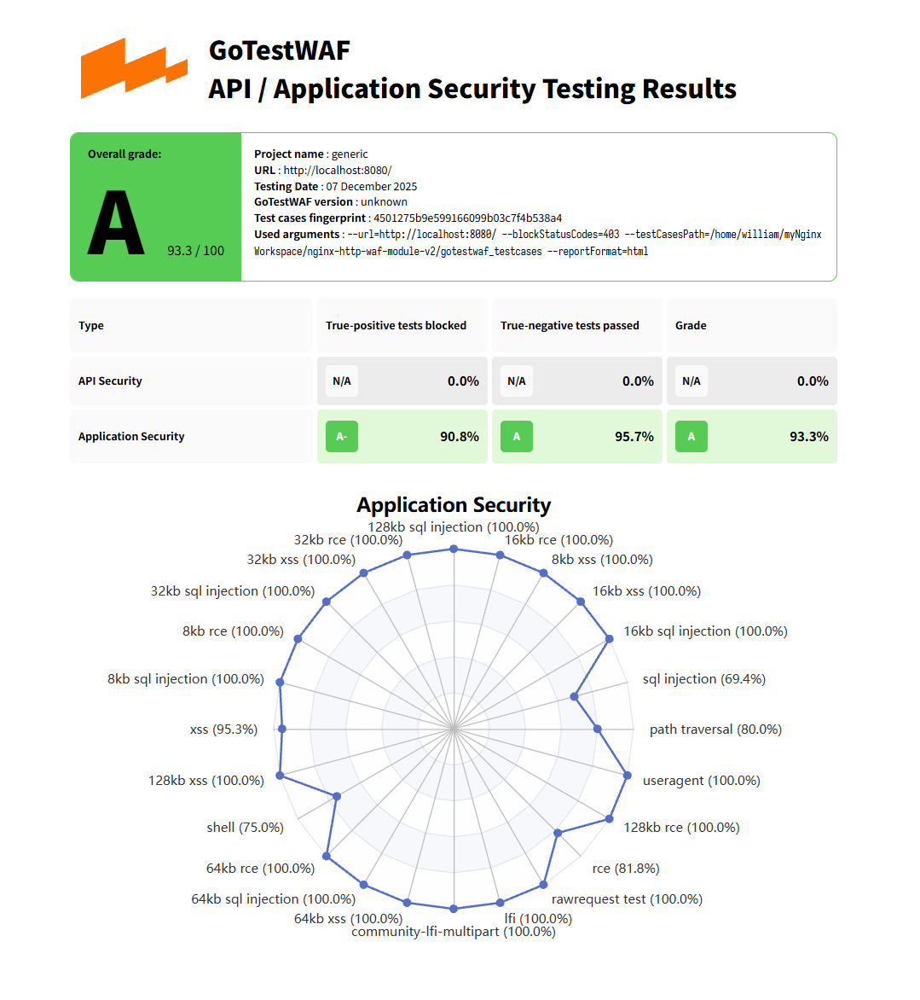

# Nginx HTTP WAF 模块 (v2.0)

## 简介

Nginx HTTP WAF (Web Application Firewall) v2 是一个基于 Nginx 的高性能、生产级 Web 应用防火墙。相比 [v1 版本](https://github.com/tyx3211/nginx-http-waf-module)，v2 重构了数据面（Data Plane）架构，引入了基于 JSON 的机器友好型规则引擎。这一设计实现了引擎内核与策略管理的彻底解耦，不仅便于人类阅读，更天然支持Web GUI 控制台、AI 自动化运维 Agent 等上层控制面（Control Plane）的程序化集成。并基于 JSON 的结构化特点实现了灵活的继承/重写机制、以及一次请求一行（JSONL）的审计日志系统。

本项目旨在为 Nginx 提供“开箱即用”的安全防护能力，覆盖 OWASP Top 10 等常见 Web 攻击，同时保持配置的简洁与运维的友好性。

> 🚀 **深度探索**：如果您想深入了解本项目的内部架构（从“胖数据面”到“五段流水线”），请移步我们的**开发者完全指南**：
>
> 👉 **[docs/architecture-v2.md](docs/architecture-v2.md)**

---

## 核心特性 (v2)

### 1. 现代化规则引擎
- **控制面解耦 (Control Plane Ready)**: 采用标准 JSON 定义规则，旨在消除数据面与管理面的耦合。Web GUI 前端或自动化脚本无需编写复杂的配置文件解析器，即可直接生成、校验和下发策略，极大降低了上下游集成的开发成本。
- **继承与重写 (`extends`)**: 支持规则集继承（如 `user_rules` 继承 `core_rules`），并可针对特定 ID 或标签进行禁用、参数重写。
- **多阶段流水线**: 内置精密编排的检测流水线（IP 白名单 -> IP 黑名单 -> 动态信誉 -> URI 白名单 -> 核心检测），确保高效拦截。

### 2. 强大的防护能力
- **核心攻击防御**: 内置 SQL 注入 (SQLi)、跨站脚本 (XSS)、目录遍历、远程代码执行 (RCE)、本地文件包含 (LFI)、恶意 User-Agent 等高危攻击的防护规则集。
- **动态信誉系统**: 基于共享内存的动态 IP 评分机制。攻击行为累积评分，超过阈值自动封禁（Block），支持自定义封禁时长与评分窗口。
- **智能解码**: 自动处理 URL 编码、HTML 实体编码等绕过手段，只需编写原始 Payload 即可防御多种变体。

### 3. 生产级审计日志
- **JSONL 格式**: 采用 `JSON Lines` 标准，一次请求输出一行完整日志，便于 Filebeat/Logstash 采集与大数据分析。
- **全景上下文**: 记录请求时间、客户端 IP、URI、命中规则链、最终决策（Block/Bypass/Log）、评分变化及动态封禁状态。
- **Decisive 标记**: 智能标记导致最终决策的“决定性事件”，快速定位拦截原因。

---

## 快速上手与部署

### 1. 编译安装 (交互式脚本)

我们提供了一个方便的交互式脚本 `script/interactive_build.sh`，可自动下载 Nginx 源码并完成编译安装。

**步骤**:
1. **克隆仓库**:
   ```bash
   git clone https://github.com/tyx3211/nginx-http-waf-module-v2.git
   cd nginx-http-waf-module-v2
   ```

2. **运行交互式脚本**:
   ```bash
   chmod +x script/interactive_build.sh
   ./script/interactive_build.sh
   ```
   *脚本会提示输入 Nginx 版本（默认 1.24.0）、安装路径（默认 `/usr/local/nginx`）等信息，确认后自动开始下载、编译并安装。*

### 2. 手动编译 (高级用户)

如果您偏好手动控制或已有 Nginx 源码：

1. **下载 Nginx 源码**: [nginx.org](http://nginx.org/en/download.html)
2. **Configure**:
   ```bash
   ./configure --prefix=/usr/local/nginx \
               --with-compat \
               --add-dynamic-module=/path/to/nginx-http-waf-module-v2 \
               # 其他您需要的模块...
   ```
3. **Build & Install**:
   ```bash
   make && sudo make install
   ```
4. **部署规则**:
   将 `WAF_RULES_JSON` 目录复制到 `/usr/local/nginx/WAF_RULES_JSON`。

### 3. 配置 Nginx

**推荐配置**：直接使用我们提供的模板 `doc/gotestwaf.nginx.conf`（已包含最佳实践配置）。

```bash
sudo cp nginx-http-waf-module-v2/doc/gotestwaf.nginx.conf /usr/local/nginx/conf/nginx.conf
```

**或者手动修改 `nginx.conf`**:

在 `http {}` 块中添加：

```nginx
# 加载模块 (若编译为动态模块)
load_module modules/ngx_http_waf_module.so;

http {
    # ...
    
    # --- WAF 核心配置 ---
    waf on;
    waf_shm_zone waf_block_zone 10m;            # 动态信誉共享内存
    waf_jsons_dir WAF_RULES_JSON;               # 规则根目录(相对prefix)
    
    # 入口规则文件 (推荐继承核心集)
    waf_rules_json user/gotestwaf_user_rules.json;

    # 审计日志
    waf_json_log logs/waf.jsonl;
    waf_json_log_level info;

    # 执法策略
    waf_default_action block;
    waf_dynamic_block_enable on;                # 开启动态封禁
    waf_dynamic_block_score_threshold 100;      # 封禁阈值
    # -------------------
}
```

**更多配置指令说明**：请参考 [docs/friendly-waf-directives-spec-v2.0.md](docs/friendly-waf-directives-spec-v2.0.md)。

### 4. 启动与验证

```bash
sudo /usr/local/nginx/sbin/nginx
# 或重载
sudo /usr/local/nginx/sbin/nginx -s reload
```

**验证方法**:
1. **简单测试**:
   访问 `http://localhost:8080/?id=1'%20or%20'1'='1`，应返回 `403 Forbidden`。
   查看日志：`tail -f /usr/local/nginx/logs/waf.jsonl`。

2. **GoTestWAF 完整测试**:
   (推荐) 使用 `gotestwaf` 配合本项目提供的测试用例集：
   ```bash
   # 安装 gotestwaf
   go install github.com/gotenberg/gotestwaf@latest
   
   # 运行测试，注意将路径替换为clone本项目的gotestwaf_testcases的绝对路径
   ~/go/bin/gotestwaf --url http://localhost:8080/ \
     --blockStatusCodes 403 \
     --testCasesPath /path/to/nginx-http-waf-module-v2/gotestwaf_testcases
   ```
   *预期结果：评分 A+ (90分以上)*

   预期测试图片：
   

   测试结果html见[doc/waf-evaluation-report-2025-December-07-23-35-30.html](doc/waf-evaluation-report-2025-December-07-23-35-30.html)

---

## 深度架构解析

### 1. 规则引擎设计

v2 规则引擎放弃了 v1 的自定义解析器，转而拥抱标准的 JSON 生态，利用 `yyjson` 高性能库进行解析。核心设计思想是 **“编译期平铺”**：

- **继承与重写 (`extends`)**:
  - 支持多层级继承（A extends B extends C）。
  - 在合并阶段，父子规则被“平铺”到一个线性数组中。
  - 子规则可以通过 `duplicatePolicy` 控制重复 ID 的处理策略（覆盖、跳过、报错）。
  - 对于继承规则：支持针对特定 ID 或 Tag 的批量禁用 (`disableById`, `disableByTag`) ，和针对特定 IDs 或 Tag 的 Targets 重新批量指定 (`rewriteTargets`)。（这里较为复杂，建议查看详细JSON规范文档）

- **高效匹配 (Compile-time Snapshot)**:
  - 在 Nginx 配置加载阶段（Configuration Phase），规则被编译为内存快照 (`waf_compiled_snapshot_t`)。
  - 规则按检测阶段（Phase）和目标（Target）被分桶存储。
  - 运行时（Runtime）只需直接遍历对应桶中的规则，无额外的解析开销。

- **规则 JSON 结构示例**:
  ```json
  {
    "meta": {
      "name": "my_policy",
      "extends": [
        "../core/core_sqli_rules.json"
      ],
      "duplicatePolicy": "warn_keep_last"
    },
    "rules": [
      {
        "id": 10001,
        "target": "ARGS_COMBINED",
        "match": "CONTAINS",
        "pattern": "bad_value",
        "action": "DENY",
        "score": 10
      }
    ]
  }
  ```
  *详细 JSON 规范请参考 [docs/friendly-waf-json-spec-v2.0.md](docs/friendly-waf-json-spec-v2.0.md)。*

### 2. 五段流水线架构 (Pipeline)

WAF 的请求处理逻辑严格遵循五段流水线，每一步都对应特定的防护目标。这种设计确保了高性能（低开销检查前置）和逻辑清晰。

1.  **IP 白名单 (`waf_stage_ip_allow`)**:
    -   **目标**: `CLIENT_IP`
    -   **动作**: `BYPASS`
    -   **逻辑**: 优先检查 IP 是否在白名单中。如果命中，直接放行，跳过后续所有检查（包括黑名单和规则检测）。

2.  **IP 黑名单 (`waf_stage_ip_deny`)**:
    -   **目标**: `CLIENT_IP`
    -   **动作**: `DENY`
    -   **逻辑**: 检查 IP 是否在黑名单中。命中则立即拦截。

3.  **动态信誉检测 (`waf_stage_reputation_base_add`)**:
    -   **逻辑**:
        1.  为当前请求增加基础访问分（`base_score`）。
        2.  检查该 IP 在共享内存中的累积评分是否超过阈值 (`dyn_block_threshold`)。
        3.  检查该 IP 是否处于封禁窗口期。
        4.  若已封禁，直接拦截；否则继续。
    -   **特点**: 跨请求的风险累积，有效防御扫描器和 CC 攻击。即便 `waf_dynamic_block_enable` 关闭，系统仍会维护 IP 评分供日志展示（但不会封禁）。

4.  **URI 白名单 (`waf_stage_uri_allow`)**:
    -   **目标**: `URI`
    -   **动作**: `BYPASS`
    -   **逻辑**: 检查请求路径是否在白名单中（如静态资源、特定 API）。命中则放行，**不再读取请求体**，极大提升性能。

5.  **深度检测 (`waf_stage_detect_bundle`)**:
    -   **目标**: `URI`, `ARGS`, `HEADERS`, `BODY`
    -   **逻辑**:
        -   如果请求体尚未读取且需要检测 Body，模块会触发读取。
        -   执行核心规则集检测（SQLi, XSS 等）。
        -   **智能解码**: 对 `ARGS_COMBINED` 等目标自动进行 URL 解码；对 `application/x-www-form-urlencoded` 的 Body 自动解码。
        -   **评分累积**: 命中规则后，除了执行动作（DENY/LOG），还会将 `score` 累积到 IP 动态信誉中，可能触发后续封禁。

### 3. 审计日志 (JSONL) 详解

v2 引入了生产级的 JSONL (JSON Lines) 日志，每行对应一个请求的完整画像。这比传统的 error.log 更加结构化，易于机器解析。

**日志字段全解**:

```json
{
  "time": "2025-12-07T15:00:55Z",
  "clientIp": "127.0.0.1",
  "method": "GET",
  "host": "localhost:8080",
  "uri": "/test",
  "finalAction": "BLOCK",
  "finalActionType": "BLOCK_BY_RULE",
  "currentGlobalAction": "BLOCK",
  "blockRuleId": 1002,
  "status": 403,
  "level": "ALERT",
  "events": [
    {
      "type": "rule",
      "ruleId": 1002,
      "intent": "BLOCK",
      "scoreDelta": 50,
      "totalScore": 100,
      "target": "args",
      "decisive": true
    }
  ]
}
```

- **基础信息**:
  - `time`, `clientIp`, `method`, `host`, `uri`: 请求基本元数据。
- **决策结果**:
  - `finalAction`: 最终对请求的处置 (`BLOCK`, `BYPASS`, `ALLOW`)。
  - `finalActionType`: 处置的具体原因 (`BLOCK_BY_RULE`, `BLOCK_BY_DYNAMIC_BLOCK`, `BYPASS_BY_URI_WHITELIST` 等)。
  - `currentGlobalAction`: 当前配置的全局默认动作 (`BLOCK` 或 `LOG`)。
  - `blockRuleId`: 导致拦截的规则 ID（若是规则拦截）。
  - `status`: 返回给客户端的 HTTP 状态码。
- **事件详情 (`events`)**:
  - 记录了请求处理过程中触发的所有重要事件。
  - `type`: 事件类型 (`rule`, `ban`, `reputation` 等)。
  - `ruleId`: 触发的规则 ID。
  - `scoreDelta`: 该事件导致的分数增加值（若动态封禁关闭，此值为 0，不计入风险）。
  - `totalScore`: 触发该事件后的 IP 即刻累计总分。**注意**：即便关闭了动态封禁功能，此字段仍会显示该 IP 在内存中的实时评分（如果有），方便运维观察风险值。
  - `decisive`: **关键字段**。标记该事件是否是导致 `finalAction` 的决定性因素（例如，命中的那条阻断规则）。

*详细 审计日志JSONL 规范请参考 [docs/friendly-waf-jsonl-spec-v2.0.md](docs/friendly-waf-jsonl-spec-v2.0.md)。*

---

## 目录结构说明

- `script/`: 包含交互式构建脚本 `interactive_build.sh`。
- `nginx-http-waf-module-v2/`: 模块 v2 核心源码。
  - `src/`: C 代码实现。
  - `WAF_RULES_JSON/`: 官方规则集仓库。
  - `docs/`: 详细设计文档与规范。
  - `doc/`: gotestwaf相关测试文档。
- `gotestwaf_testcases/`: 专用测试用例集。
